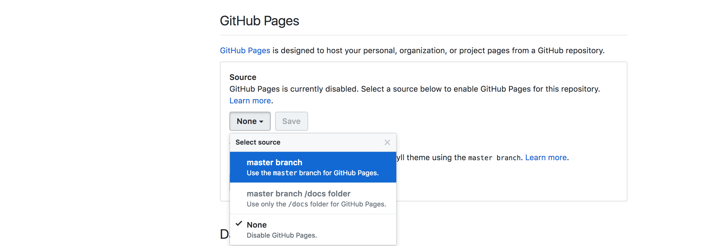

# album-shelf

`album-shelf` is a static web page to display and explore my collection of music records.

Screenshot from [adrienjoly.com/album-shelf](https://adrienjoly.com/album-shelf):


It uses Jekyll to render the list in HTML from a YAML data file (see [`albums.yaml`](./_data/albums.yaml)) and Github-pages to make it accessible to the public.

If you want to have a similar page for your own album collection, feel free to fork this repository and replace my list of albums by yours!

## Features

### Add album from Spotify

```
$ npm run add:spotify-album >>_data/albums.yaml
```

### Extract albums from user's playlists on Spotify

```
$ npm run export:spotify-playlists >>_data/albums.yaml
```

## How to publish my own collection?

> Notice: In order to create and publish your collection, you need to have a Github account, to be familiar with `git` and with the use of the command line.

Follow these steps:

1. fork this repository into your own Github account;
2. update your copy of `_config.yml` to fill your name and Google Analytics ID;
3. edit your copy of `albums.yaml`;
4. test your changes locally by running `npm install`, then `npm start`;
5. commit and push your changes to your fork repository (e.g. using `git push`);
6. activate Github-pages on your `master` branch, as displayed below:




7. browse your collection on `http://<your_github_username>.github.io/album-shelf`. 👌
